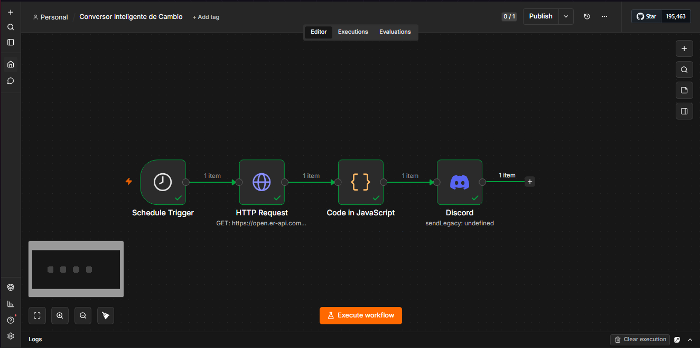
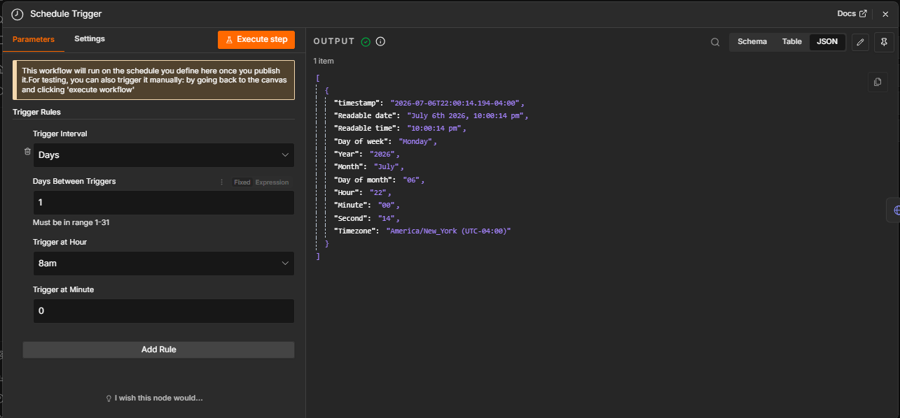
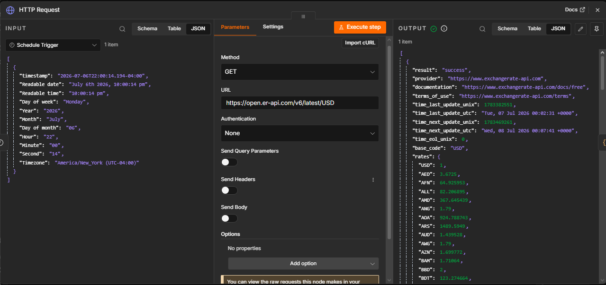
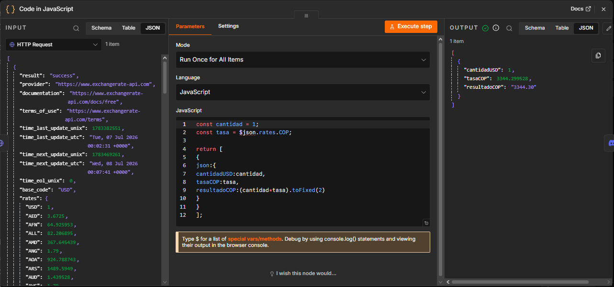
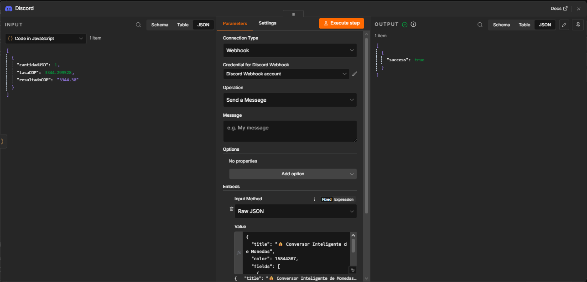
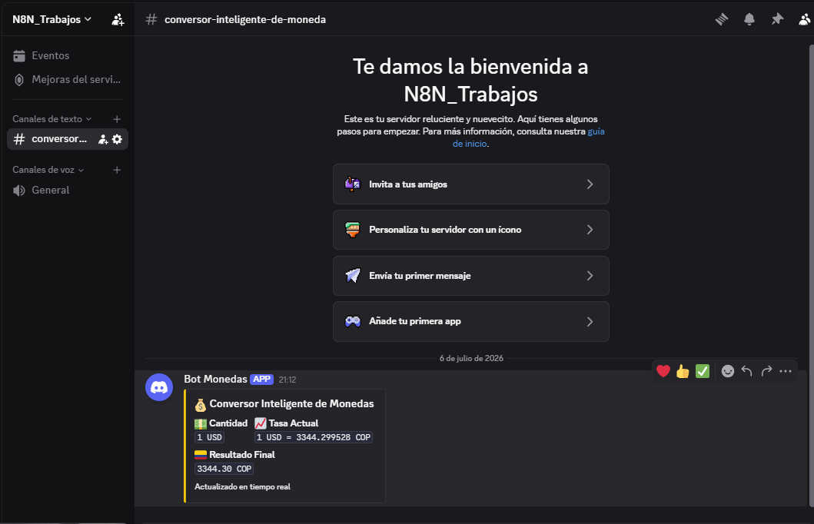

# Conversor Inteligente de Monedas con n8n

## Integrantes

- Jonathan Luna
- Nombre del compañero

---

# Explicación del problema

En muchas ocasiones es necesario conocer el valor actualizado de una moneda extranjera para realizar conversiones a pesos colombianos (COP). Consultar manualmente el tipo de cambio puede ser repetitivo y consumir tiempo.

Para solucionar este problema se desarrolló una automatización en **n8n** que diariamente consulta una API pública de tasas de cambio, obtiene el valor actual del dólar estadounidense (USD), realiza automáticamente la conversión a pesos colombianos (COP) y envía el resultado mediante un mensaje con formato **Embed** al canal de Discord.

---

# Investigación realizada

## Investigación sobre APIs de tasas de cambio

Antes de desarrollar el workflow se investigaron varias APIs públicas para obtener tasas de cambio en tiempo real. Finalmente se seleccionó **ExchangeRate-API** porque ofrecía una versión gratuita, una documentación sencilla y una respuesta en formato JSON fácil de procesar desde n8n.

La consulta utilizada fue:

```http
GET https://open.er-api.com/v6/latest/USD
```

La respuesta de la API contiene información como:

- Moneda base.
- Fecha de actualización.
- Hora de actualización.
- Tasas de cambio de más de 150 monedas.
- Valor del peso colombiano (COP).

Gracias a esta API fue posible obtener automáticamente el valor actualizado del dólar sin necesidad de ingresar la información manualmente.

---

## Investigación sobre JSON

También fue necesario investigar el formato **JSON (JavaScript Object Notation)**, ya que la API devuelve toda la información organizada mediante objetos y atributos.

Ejemplo de la respuesta:

```json
{
  "base_code": "USD",
  "rates": {
    "COP": 3344.299528
  }
}
```

En el nodo de JavaScript de n8n únicamente se utilizó el dato:

```javascript
rates.COP
```

Este valor corresponde al precio actual del dólar en pesos colombianos y posteriormente fue utilizado para realizar la conversión.

---

## Investigación sobre Discord Embed

Además de consultar la API, fue necesario investigar cómo construir mensajes utilizando el **JSON nativo de Discord**.

Inicialmente el mensaje se enviaba como texto plano, pero posteriormente se investigó la estructura de los **Embeds**, lo que permitió mejorar considerablemente la presentación de la información.

Durante esta investigación se aprendió el funcionamiento de propiedades como:

- `title`
- `color`
- `fields`
- `footer`

Gracias a ello fue posible crear un mensaje más organizado, profesional y fácil de leer, mostrando:

- Cantidad de dólares.
- Tasa de cambio actual.
- Resultado en pesos colombianos.
- Mensaje indicando que la información fue actualizada en tiempo real.

Esta investigación permitió cumplir con uno de los puntos extra del reto, mejorando el formato visual del mensaje enviado a Discord.

---

## Investigación sobre JavaScript en n8n

También fue necesario investigar cómo utilizar el nodo **Code (JavaScript)** de n8n.

Se desarrolló un pequeño script que:

- Obtiene la tasa COP desde la respuesta de la API.
- Multiplica la cantidad de dólares.
- Formatea el resultado con dos decimales.
- Devuelve la información para que posteriormente sea utilizada por el nodo de Discord.

---

# Desarrollo paso a paso

## Paso 1. Schedule Trigger

Se configuró un **Schedule Trigger** para ejecutar automáticamente el workflow todos los días a las 8:00 a.m., evitando la ejecución manual.

> Insertar captura del Schedule Trigger.

---

## Paso 2. HTTP Request

Se agregó un nodo **HTTP Request** que realiza una petición GET a la API pública.

URL utilizada:

```text
https://open.er-api.com/v6/latest/USD
```

Este nodo obtiene todas las tasas de cambio disponibles.

> Insertar captura del HTTP Request.

---

## Paso 3. Nodo Code (JavaScript)

Posteriormente se utilizó un nodo de JavaScript para:

- Obtener la tasa COP.
- Multiplicar la cantidad de dólares.
- Formatear el resultado.
- Preparar los datos para Discord.

> Insertar captura del nodo JavaScript.

---

## Paso 4. Discord Webhook

Finalmente se configuró un **Discord Webhook** para enviar automáticamente el resultado utilizando un mensaje tipo **Embed**.

El mensaje incluye:

- Cantidad.
- Tasa actual.
- Resultado final.
- Información visual mediante colores y secciones.

> Insertar captura del nodo Discord.

---

# APIs utilizadas

## ExchangeRate-API

**Tipo**

API REST

**Método utilizado**

```http
GET
```

**Endpoint**

```text
https://open.er-api.com/v6/latest/USD
```

### Información obtenida

- Moneda base.
- Tasas de cambio.
- Valor del COP.
- Fecha de actualización.

### Razones para utilizar esta API

- Es gratuita.
- No requiere autenticación para este proyecto.
- Tiene una documentación clara.
- Entrega la información en formato JSON.
- Es compatible con HTTP Request de n8n.

---

# Resultados obtenidos

El workflow logró cumplir correctamente con todos los requisitos establecidos.

Se consiguió:

- Ejecutar automáticamente el flujo.
- Consultar una API pública.
- Obtener el valor del dólar.
- Convertir automáticamente el resultado a pesos colombianos.
- Procesar los datos mediante JavaScript.
- Enviar automáticamente el resultado a Discord.
- Mejorar la presentación utilizando un mensaje tipo Embed.

---

# Capturas del workflow

Agregar las siguientes capturas:

- Workflow completo.
- Schedule Trigger.
- HTTP Request.
- Nodo JavaScript.
- Nodo Discord.

---

# Capturas de Discord

Agregar la captura del mensaje enviado correctamente al canal de Discord.

---

# Conclusiones

- n8n permite crear automatizaciones sin desarrollar aplicaciones completas.
- Las APIs REST permiten obtener información en tiempo real desde servicios externos.
- El formato JSON facilita el intercambio de datos entre aplicaciones.
- La investigación sobre la estructura JSON de los Embeds de Discord permitió mejorar considerablemente la presentación del mensaje enviado.
- La integración entre n8n, ExchangeRate-API y Discord permitió desarrollar una automatización funcional que cumple con todos los requisitos planteados en el reto.


# IMAGENES
















